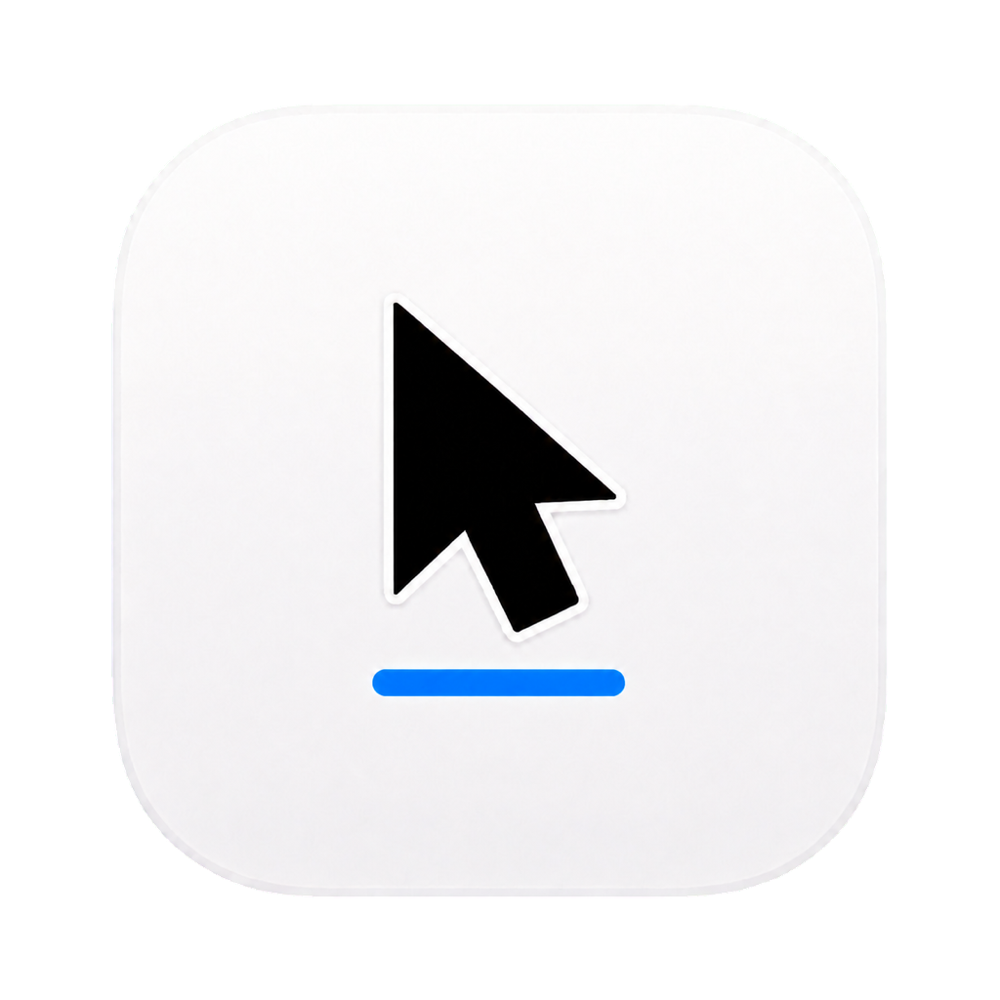

# CopyCue

<p align="center">
  
</p>

[](https://github.com/IvanKomarov00/copycue/actions/workflows/ci.yml)
[](https://www.npmjs.com/package/@morning-corp/copycue)
[](LICENSE)

Copy with confidence on macOS.

CopyCue is a lightweight native menu-bar app that makes successful clipboard changes visible. Whenever the macOS clipboard changes, CopyCue briefly shows an Apple-blue indicator near the pointer in your chosen position and a confirmation in the menu bar. If a second copy overwrites something important, the immediately previous text remains available to restore.

## Why CopyCue?

Pasting provides instant feedback; copying usually does not. CopyCue closes that gap without monitoring global keyboard input. It observes the macOS pasteboard itself, so it also detects copies made from context menus or other application controls.

## Features

- Confirms clipboard changes with subtle cursor and menu-bar feedback.
- Keeps only the current and immediately previous distinct text values.
- Restores accidentally overwritten text from the menu-bar menu.
- Places the cursor indicator below, left, above, or right of the pointer.
- Offers 0.5, 1, and 2 second cursor-feedback durations.
- Runs as a native menu-bar utility without a Dock icon.
- Uses no global keyboard listener, network connection, account, analytics, or telemetry.
- Clears retained text when CopyCue quits.

## Requirements

- Apple Silicon Mac
- macOS 13 or later
- Node.js 18 or later with npm, for the one-command installer

Intel support, Developer ID signing, and notarization are not included in the current MVP.

## Install

```bash
npx --yes @morning-corp/copycue@latest install
```

CopyCue is installed at `~/Applications/CopyCue.app` and opens automatically. No administrator password or global npm installation is required.

The current MVP is ad-hoc signed. On some Macs, the first launch may require approval from **System Settings → Privacy & Security → Open Anyway**.

### Update

Run the installation command again. The installer verifies and safely replaces the existing app bundle.

```bash
npx --yes @morning-corp/copycue@latest install
```

### Uninstall

```bash
npx --yes @morning-corp/copycue@latest uninstall
```

## Use

1. Start CopyCue and find the overlapping-pages icon in the menu bar.
2. Copy text with Command-C, a context menu, or another application control.
3. Look for the blue pointer indicator and temporary menu-bar confirmation.
4. To recover overwritten text, open the CopyCue menu and choose **Restore previous**.
5. Open **Settings…** to choose the cursor-feedback position and duration.

CopyCue confirms clipboard changes. Because it deliberately does not intercept keyboard input, it cannot report a copy shortcut that failed before the clipboard changed.

## Privacy

CopyCue contains no networking or telemetry code. It reads the clipboard's plain-text representation only after macOS reports a change and retains at most two values of up to 1 MiB each in process memory. Larger clipboard changes still receive visual confirmation but are not retained in history.

Clipboard history is not intentionally written to files, preferences, logs, or a database. The selected feedback position and duration are stored in macOS user preferences. See [PRIVACY.md](PRIVACY.md) for the complete data-handling description.

## Build from source

Install Xcode 16 or another compatible Swift 6 toolchain, then run:

```bash
git clone https://github.com/IvanKomarov00/copycue.git
cd copycue
./scripts/build-app.sh
open dist/CopyCue.app
```

The build script creates an ad-hoc-signed app at `dist/CopyCue.app`.

The repository includes the 1024px icon master and generated ICNS file. If you change the master artwork, regenerate the native icon before building:

```bash
npm run build:icon
```

## Test

```bash
npm test
```

The test suite covers two-item clipboard history, oversized-value rejection, installation, safe replacement, code-signature verification, and uninstallation. The project currently has no third-party npm or Swift package dependencies.

## Contributing

Issues and pull requests are welcome.

1. Fork the repository and create a focused branch.
2. Add or update tests for behavioral changes.
3. Run `npm test` locally.
4. Open a pull request describing the problem, approach, and user-visible effect.

Keep CopyCue lightweight, local-first, and free of global keyboard monitoring. Maintainer release instructions are in [PUBLISHING.md](PUBLISHING.md).

## Security

Please do not disclose unpatched vulnerabilities in public issues. Follow [SECURITY.md](SECURITY.md) to submit a private vulnerability report through GitHub.

## License

CopyCue is available under the [MIT License](LICENSE).
